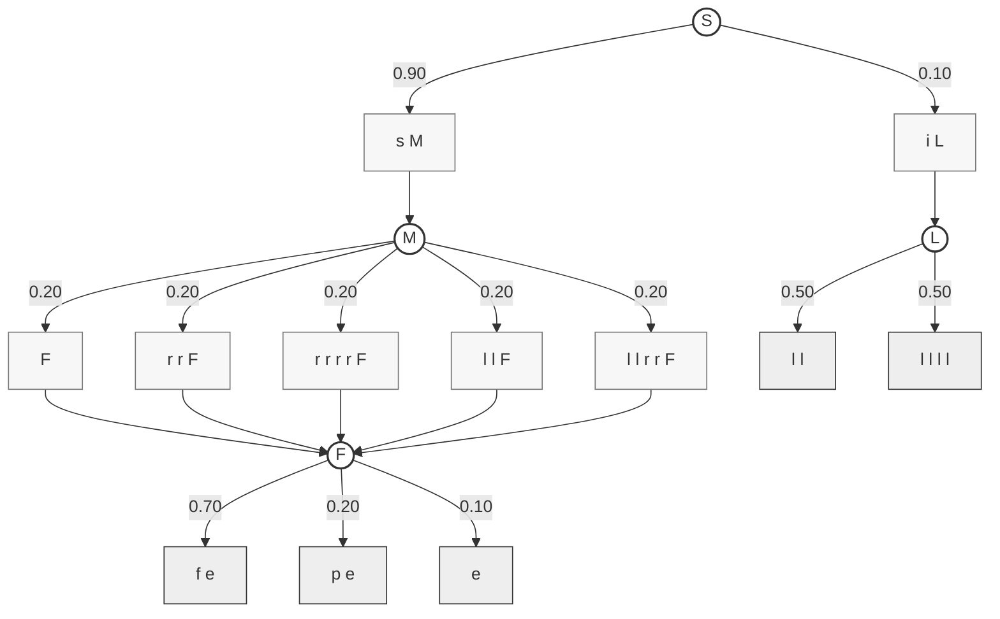
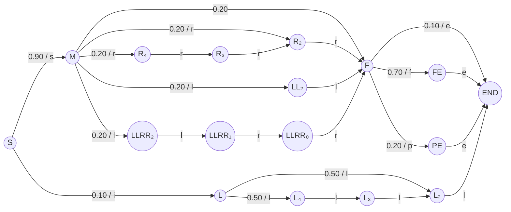

# Zombienella importunus

## Grammar

```
S -> s M | i L.
M -> F | r r F | r r r r F | l l F | l l r r F.
F -> f e | p e | e.
L -> l l | l l l l.
```

## Derivations

```
s r r f e
s r r p e
s r r e
s r r r r f e
s r r r r p e
s r r r r e
s l l r r f e
s l l r r p e
s l l r r e
s f e
s p e
s e
s l l f e
s l l p e
s l l e
i l l
i l l l l
```

## Transition Probabilities

```
S -> s M (0.90)
S -> i L (0.10)
---
M -> F (0.20)
M -> r r F (0.20)
M -> r r r r F (0.20)
M -> l l F (0.20)
M -> l l r r F (0.20)
---
F -> f e (0.70)
F -> p e (0.20)
F -> e (0.10)
---
L -> l l (0.50)
L -> l l l l (0.50)
```

## Mermaid Diagram



## Markov Chain

