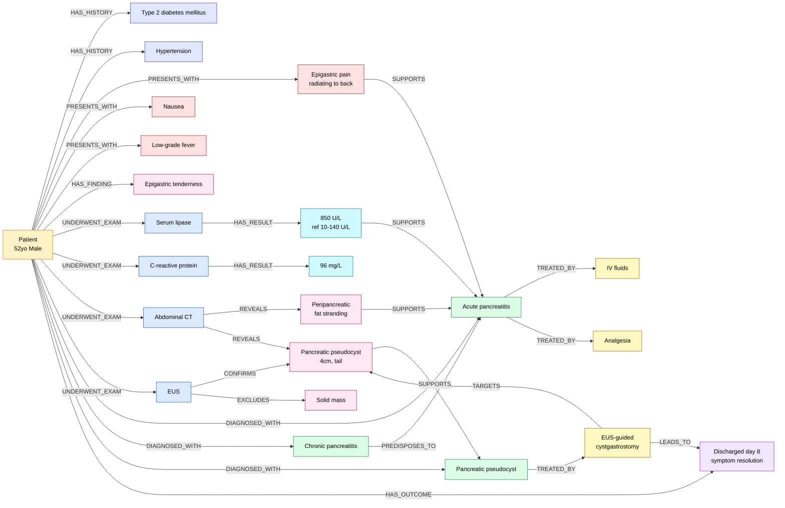

# Processamento de Linguagem Natural 2026

## Projeto 1

Este laboratório envolve a extração de dados de um repositório que cataloga milhares de casos clínicos, conhecido como MultiCaRe, e cada caso em um grafo de conhecimento. O MultiCaRe está descrito no artigo:

> Nievas Offidani, M., Roffet, F., González Galtier, M. C., Massiris, M., & Delrieux, C. (2025). An Open-Source Clinical Case Dataset for Medical Image Classification and Multimodal AI Applications. Data 2025, Vol. 10, Page 123, 10(8), 123. https://doi.org/10.3390/DATA10080123

O banco de dados extraiu os casos clínicos disponíveis de artigos publicados no PubMed.

Na pasta [sample/](sample/) estão disponíveis três arquivos de amostra, extraídos pelo notebook [`02a_csv_data_exploraton_sample.ipynb`](../../../to-kg/notebooks/02a_csv_data_exploraton_sample.ipynb) a partir de uma amostra fixa de 50 artigos do MultiCaRe (mais detalhes em [`to-kg/docs/data_source.md`](../../../to-kg/docs/data_source.md)):

- **[cases.csv](sample/cases.csv)** — um caso clínico por linha (um paciente). Colunas: `article_id` (PMCID do artigo, chave estrangeira para `metadata.csv`), `case_id` (`article_id` + sufixo sequencial, ex. `PMC5137649_01`), `case_text` (texto integral do relato de caso — a principal fonte para a extração de entidades e relações), `age` (idade; valores menores que 1 ano aparecem como 0) e `gender` (`Female`, `Male`, `Transgender` ou `Unknown`). 246 casos nesta amostra.

- **[metadata.csv](sample/metadata.csv)** — um artigo por linha. Colunas: `article_id` (PMCID, chave primária), `title`, `authors`, `journal`, `journal_detail`, `year`, `doi`, `pmid`, `pmcid`, `mesh_terms`/`major_mesh_terms` (termos MeSH do artigo), `keywords`, `link`, `license` e `case_amount` (nº de casos daquele artigo). Útil para contextualizar cada caso — por exemplo, cruzar as entidades extraídas do texto com os termos MeSH do artigo de origem, ou verificar a licença antes de reusar um trecho. 50 artigos nesta amostra. Atenção: como CSV não tem tipo array nativo, colunas de lista (`authors`, `mesh_terms`, `major_mesh_terms`, `keywords`) aparecem como texto entre colchetes (ex. `[Female]`), e `year` é texto, não número.

- **[data_dictionary.csv](sample/data_dictionary.csv)** — dicionário de dados original do Zenodo (colunas `file`, `field`, `explanation`), copiado sem filtro. Ele documenta os campos de **todos** os arquivos do dataset publicado, incluindo `captions_and_labels.csv`, `case_images.parquet` e `abstracts.parquet` — que **não** fazem parte desta amostra nem são usados neste projeto (o dataset original é focado em classificação de imagens médicas, e este projeto usa apenas o texto dos casos). Use as linhas com `file` igual a `cases.parquet` ou `metadata.parquet` como referência para os dois arquivos acima.

A equipe deve refletir e propor uma abordagem para os seguintes pontos:
1. Quais são os dados interessantes para serem extraídos e como:
  * entidades: sintomas, doenças, exames, tratamentos, medicamentos, regiões anatômicas, etc.;
  * valores associados a resultados de exames e dosagem de medicamentos, bem como suas unidades de medida;
2. Como é interessante organizar estes dados em um grafo de conhecimento.
3. Estratégias clássicas para extrair os dados desejados do texto: tokenização, normalização, remoção de stop-words, associação a dicionários/tesauros/ontologias

Para este estágio de trabalho, não poderão ser usados modelos de linguagem para a extração dos dados. A equipe deve explorar as técnicas tradicionais de modo que entenda cada algoritmo que foi usado e seu impacto na geração final do grafo.

## Formato de extração do grafo de conhecimento

O grafo extraído de cada caso deve ser representado em duas tabelas simples:

* **nós**, com a identificação e os atributos de cada entidade extraída;
* **arestas**, com o nó de origem, o nó de destino e os atributos da relação entre eles.

Sugestão de esquema (livre para a equipe ajustar, mas mantendo a ideia de duas tabelas):

* **nós**: `node_id`, `type` (ex. `Symptom`, `Diagnosis`, `Exam`, `ExamResult`, `Treatment`, ...), `label` (nome/forma normalizada da entidade) e `attributes` (demais atributos da entidade, como `value`, `unit`, `reference_range`, `status`, `onset`, etc.).
* **arestas**: `edge_id`, `source_id`, `target_id`, `relation` (ex. `HAS_SYMPTOM`, `UNDERWENT_EXAM`, `SUPPORTS`, `TREATED_BY`, ...) e `attributes` (ex. trecho do texto que evidencia a relação, confiança, etc.).

Abaixo, um exemplo (em inglês, no estilo dos casos do MultiCaRe) mostrando um texto de caso clínico e o grafo de conhecimento que poderia ser extraído dele. O exemplo é ilustrativo: procura decompor o texto ao máximo (sintomas, histórico clínico, exames, resultados de exames com valor/unidade/referência, achados de imagem, diagnósticos e tratamentos), mas a equipe não precisa seguir exatamente estes mesmos tipos de nó/aresta.

### Texto de exemplo

> A 52-year-old man with a history of type 2 diabetes mellitus and hypertension presented to the emergency department with a 5-day history of progressive epigastric pain radiating to the back, accompanied by nausea and low-grade fever. Physical examination revealed epigastric tenderness without rebound. Laboratory tests showed elevated serum lipase (850 U/L, reference range 10-140 U/L) and C-reactive protein of 96 mg/L. Abdominal contrast-enhanced computed tomography (CT) demonstrated peripancreatic fat stranding and a 4 cm pseudocyst adjacent to the pancreatic tail. Endoscopic ultrasound (EUS) confirmed the pseudocyst and excluded a solid mass. Based on clinical presentation, laboratory findings, and imaging, a diagnosis of acute pancreatitis with pseudocyst formation, superimposed on chronic pancreatitis, was established. The patient was treated with intravenous fluids and analgesia, and underwent EUS-guided cystgastrostomy for pseudocyst drainage. He was discharged on day 8 with resolution of symptoms.

### Tabela de nós

| node_id | type | label | attributes |
|---|---|---|---|
| P1 | Patient | case PMC_EXAMPLE_01 | age=52; gender=Male |
| C1 | History | Type 2 diabetes mellitus | status=pre-existing |
| C2 | History | Hypertension | status=pre-existing |
| S1 | Symptom | Epigastric pain radiating to back | duration=5 days; course=progressive |
| S2 | Symptom | Nausea | |
| S3 | Symptom | Low-grade fever | |
| F1 | Finding | Epigastric tenderness | source=physical examination |
| E1 | Exam | Serum lipase | modality=laboratory |
| R1 | ExamResult | 850 U/L | value=850; unit=U/L; reference_range=10-140 U/L; interpretation=elevated |
| E2 | Exam | C-reactive protein | modality=laboratory |
| R2 | ExamResult | 96 mg/L | value=96; unit=mg/L; interpretation=elevated |
| E3 | Exam | Abdominal contrast-enhanced CT | modality=imaging |
| F2 | Finding | Peripancreatic fat stranding | source=CT |
| F3 | Finding | Pancreatic pseudocyst, 4 cm | location=pancreatic tail; size=4 cm; source=CT+EUS |
| E4 | Exam | Endoscopic ultrasound (EUS) | modality=imaging |
| F4 | Finding | Solid mass | status=excluded; source=EUS |
| D1 | Diagnosis | Acute pancreatitis | |
| D2 | Diagnosis | Chronic pancreatitis | qualifier=underlying condition |
| D3 | Diagnosis | Pancreatic pseudocyst | |
| T1 | Treatment | Intravenous fluids | |
| T2 | Treatment | Analgesia | |
| T3 | Treatment | EUS-guided cystgastrostomy | type=procedure |
| O1 | Outcome | Discharged, day 8, symptom resolution | length_of_stay=8 days |

### Tabela de arestas

| edge_id | source_id | target_id | relation | attributes |
|---|---|---|---|---|
| e1 | P1 | C1 | HAS_HISTORY | |
| e2 | P1 | C2 | HAS_HISTORY | |
| e3 | P1 | S1 | PRESENTS_WITH | |
| e4 | P1 | S2 | PRESENTS_WITH | |
| e5 | P1 | S3 | PRESENTS_WITH | |
| e6 | P1 | F1 | HAS_FINDING | |
| e7 | P1 | E1 | UNDERWENT_EXAM | |
| e8 | E1 | R1 | HAS_RESULT | |
| e9 | P1 | E2 | UNDERWENT_EXAM | |
| e10 | E2 | R2 | HAS_RESULT | |
| e11 | P1 | E3 | UNDERWENT_EXAM | |
| e12 | E3 | F2 | REVEALS | |
| e13 | E3 | F3 | REVEALS | |
| e14 | P1 | E4 | UNDERWENT_EXAM | |
| e15 | E4 | F3 | CONFIRMS | |
| e16 | E4 | F4 | EXCLUDES | |
| e17 | S1 | D1 | SUPPORTS | |
| e18 | R1 | D1 | SUPPORTS | |
| e19 | F2 | D1 | SUPPORTS | |
| e20 | F3 | D3 | SUPPORTS | |
| e21 | D2 | D1 | PREDISPOSES_TO | |
| e22 | P1 | D1 | DIAGNOSED_WITH | |
| e23 | P1 | D2 | DIAGNOSED_WITH | |
| e24 | P1 | D3 | DIAGNOSED_WITH | |
| e25 | D1 | T1 | TREATED_BY | |
| e26 | D1 | T2 | TREATED_BY | |
| e27 | D3 | T3 | TREATED_BY | |
| e28 | T3 | F3 | TARGETS | |
| e29 | P1 | O1 | HAS_OUTCOME | |
| e30 | T3 | O1 | LEADS_TO | |

### Grafo

