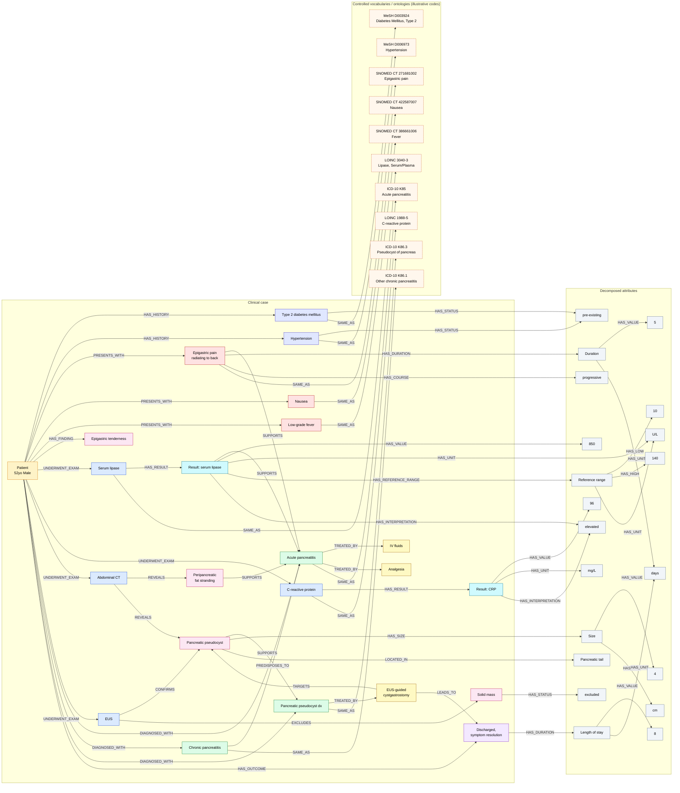

# Exemplo 2 — decomposição de atributos ao estilo RDF, com vocabulários controlados

Ver também: [README.md](README.md) (enunciado do projeto) e [example1.md](example1.md) (mesmo caso clínico, com atributos agregados nos nós em vez de decompostos).

Este exemplo usa o **mesmo caso clínico do [Exemplo 1](example1.md)**, mas leva a decomposição mais longe, inspirada no modelo de triplas do RDF (sujeito–predicado–objeto): em vez de um atributo como `value=850; unit=U/L` ficar embutido na coluna `attributes` de um nó `ExamResult`, o valor `850` e a unidade `U/L` viram nós próprios, ligados ao resultado por arestas `HAS_VALUE` e `HAS_UNIT`. O mesmo padrão é aplicado a duração, tamanho, faixa de referência, interpretação e status. O formato de tabelas (nós/arestas) continua o mesmo do README — só muda o quanto cada atributo é decomposto.

Duas vantagens desse nível de decomposição:

* **reuso** — nós de valor/unidade/status idênticos podem ser compartilhados por várias entidades (por exemplo, a unidade `days` é reaproveitada na duração do sintoma e no tempo de internação; a interpretação `elevated` é reaproveitada pelos dois exames laboratoriais; o status `pre-existing` é reaproveitado pelas duas condições do histórico clínico). Isso facilita consultas como "todos os resultados interpretados como elevated" sem precisar comparar strings dentro de um campo de atributos.
* **vínculo com vocabulários controlados/ontologias** — sintomas, tipos de exame e diagnósticos passam a apontar (relação `SAME_AS`) para um nó externo representando o conceito equivalente em um vocabulário de referência (SNOMED CT, LOINC, ICD-10, MeSH). Isso é o mesmo princípio já presente em `metadata.csv` (coluna `mesh_terms` — ver [README.md](README.md)), só que aplicado a entidades extraídas do texto do caso, não do artigo inteiro.

Esse nível de decomposição tem um custo: o grafo fica maior e mais verboso, e nem toda consulta precisa dele. **Não é obrigatório decompor tudo** — por exemplo, abaixo o atributo `type=procedure` do tratamento `T3` permanece agregado, só para ilustrar que a equipe pode escolher, atributo a atributo, o nível de granularidade que faz sentido para o projeto.

> **Sobre os códigos usados abaixo:** os códigos de SNOMED CT, LOINC, ICD-10 e MeSH neste exemplo são **ilustrativos** — servem para mostrar o padrão de modelagem (nó de conceito externo + aresta `SAME_AS` com `scheme`/`code`), não para serem copiados como referência médica. Antes de adotar um vocabulário no projeto, a equipe deve verificar os códigos na fonte oficial correspondente.

### Texto de exemplo

> A 52-year-old man with a history of type 2 diabetes mellitus and hypertension presented to the emergency department with a 5-day history of progressive epigastric pain radiating to the back, accompanied by nausea and low-grade fever. Physical examination revealed epigastric tenderness without rebound. Laboratory tests showed elevated serum lipase (850 U/L, reference range 10-140 U/L) and C-reactive protein of 96 mg/L. Abdominal contrast-enhanced computed tomography (CT) demonstrated peripancreatic fat stranding and a 4 cm pseudocyst adjacent to the pancreatic tail. Endoscopic ultrasound (EUS) confirmed the pseudocyst and excluded a solid mass. Based on clinical presentation, laboratory findings, and imaging, a diagnosis of acute pancreatitis with pseudocyst formation, superimposed on chronic pancreatitis, was established. The patient was treated with intravenous fluids and analgesia, and underwent EUS-guided cystgastrostomy for pseudocyst drainage. He was discharged on day 8 with resolution of symptoms.

### Grafo

### Tabela de nós

| node_id | type | label | attributes |
|---|---|---|---|
| P1 | Patient | case PMC_EXAMPLE_01 | age=52; gender=Male |
| C1 | History | Type 2 diabetes mellitus | |
| C2 | History | Hypertension | |
| S1 | Symptom | Epigastric pain radiating to back | |
| S2 | Symptom | Nausea | |
| S3 | Symptom | Low-grade fever | |
| F1 | Finding | Epigastric tenderness | source=physical examination |
| E1 | Exam | Serum lipase | modality=laboratory |
| R1 | ExamResult | Result: serum lipase | |
| E2 | Exam | C-reactive protein | modality=laboratory |
| R2 | ExamResult | Result: CRP | |
| E3 | Exam | Abdominal contrast-enhanced CT | modality=imaging |
| F2 | Finding | Peripancreatic fat stranding | source=CT |
| F3 | Finding | Pancreatic pseudocyst | source=CT+EUS |
| E4 | Exam | Endoscopic ultrasound (EUS) | modality=imaging |
| F4 | Finding | Solid mass | source=EUS |
| D1 | Diagnosis | Acute pancreatitis | |
| D2 | Diagnosis | Chronic pancreatitis | qualifier=underlying condition |
| D3 | Diagnosis | Pancreatic pseudocyst | |
| T1 | Treatment | Intravenous fluids | |
| T2 | Treatment | Analgesia | |
| T3 | Treatment | EUS-guided cystgastrostomy | type=procedure |
| O1 | Outcome | Discharged, symptom resolution | |
| M1 | Measurement | duration of S1 | role=duration |
| M2 | Measurement | size of F3 | role=size |
| M3 | Measurement | length of stay of O1 | role=length_of_stay |
| RR1 | ReferenceRange | reference range of R1 | |
| V5 | Value | 5 | datatype=xsd:decimal |
| V4 | Value | 4 | datatype=xsd:decimal |
| V8 | Value | 8 | datatype=xsd:decimal |
| V850 | Value | 850 | datatype=xsd:decimal |
| V96 | Value | 96 | datatype=xsd:decimal |
| V10 | Value | 10 | datatype=xsd:decimal |
| V140 | Value | 140 | datatype=xsd:decimal |
| UDAYS | Unit | days | ucum_code=d |
| UCM | Unit | cm | ucum_code=cm |
| UUL | Unit | U/L | ucum_code=U/L |
| UMGL | Unit | mg/L | ucum_code=mg/L |
| IELEV | Interpretation | elevated | |
| SITE1 | AnatomicalSite | Pancreatic tail | |
| STPRE | Status | pre-existing | |
| STEXCL | Status | excluded | |
| CRSPROG | Course | progressive | |
| VC1 | VocabConcept | Diabetes Mellitus, Type 2 | scheme=MeSH; code=D003924 |
| VC2 | VocabConcept | Hypertension | scheme=MeSH; code=D006973 |
| VCS1 | VocabConcept | Epigastric pain | scheme=SNOMED CT; code=271681002 |
| VCS2 | VocabConcept | Nausea | scheme=SNOMED CT; code=422587007 |
| VCS3 | VocabConcept | Fever | scheme=SNOMED CT; code=386661006 |
| VCE1 | VocabConcept | Lipase [Enzymatic activity/volume] in Serum or Plasma | scheme=LOINC; code=3040-3 |
| VCE2 | VocabConcept | C reactive protein [Mass/volume] in Serum or Plasma | scheme=LOINC; code=1988-5 |
| VCD1 | VocabConcept | Acute pancreatitis | scheme=ICD-10; code=K85 |
| VCD2 | VocabConcept | Other chronic pancreatitis | scheme=ICD-10; code=K86.1 |
| VCD3 | VocabConcept | Pseudocyst of pancreas | scheme=ICD-10; code=K86.3 |

### Tabela de arestas

| edge_id | source_id | target_id | relation | attributes |
|---|---|---|---|---|
| e1 | P1 | C1 | HAS_HISTORY | |
| e2 | P1 | C2 | HAS_HISTORY | |
| e3 | P1 | S1 | PRESENTS_WITH | |
| e4 | P1 | S2 | PRESENTS_WITH | |
| e5 | P1 | S3 | PRESENTS_WITH | |
| e6 | P1 | F1 | HAS_FINDING | |
| e7 | P1 | E1 | UNDERWENT_EXAM | |
| e8 | E1 | R1 | HAS_RESULT | |
| e9 | P1 | E2 | UNDERWENT_EXAM | |
| e10 | E2 | R2 | HAS_RESULT | |
| e11 | P1 | E3 | UNDERWENT_EXAM | |
| e12 | E3 | F2 | REVEALS | |
| e13 | E3 | F3 | REVEALS | |
| e14 | P1 | E4 | UNDERWENT_EXAM | |
| e15 | E4 | F3 | CONFIRMS | |
| e16 | E4 | F4 | EXCLUDES | |
| e17 | S1 | D1 | SUPPORTS | |
| e18 | R1 | D1 | SUPPORTS | |
| e19 | F2 | D1 | SUPPORTS | |
| e20 | F3 | D3 | SUPPORTS | |
| e21 | D2 | D1 | PREDISPOSES_TO | |
| e22 | P1 | D1 | DIAGNOSED_WITH | |
| e23 | P1 | D2 | DIAGNOSED_WITH | |
| e24 | P1 | D3 | DIAGNOSED_WITH | |
| e25 | D1 | T1 | TREATED_BY | |
| e26 | D1 | T2 | TREATED_BY | |
| e27 | D3 | T3 | TREATED_BY | |
| e28 | T3 | F3 | TARGETS | |
| e29 | P1 | O1 | HAS_OUTCOME | |
| e30 | T3 | O1 | LEADS_TO | |
| e31 | S1 | M1 | HAS_DURATION | |
| e32 | M1 | V5 | HAS_VALUE | |
| e33 | M1 | UDAYS | HAS_UNIT | |
| e34 | S1 | CRSPROG | HAS_COURSE | |
| e35 | F3 | M2 | HAS_SIZE | |
| e36 | M2 | V4 | HAS_VALUE | |
| e37 | M2 | UCM | HAS_UNIT | |
| e38 | F3 | SITE1 | LOCATED_IN | |
| e39 | O1 | M3 | HAS_DURATION | |
| e40 | M3 | V8 | HAS_VALUE | |
| e41 | M3 | UDAYS | HAS_UNIT | reuses node of e33 |
| e42 | R1 | V850 | HAS_VALUE | |
| e43 | R1 | UUL | HAS_UNIT | |
| e44 | R1 | RR1 | HAS_REFERENCE_RANGE | |
| e45 | RR1 | V10 | HAS_LOW | |
| e46 | RR1 | V140 | HAS_HIGH | |
| e47 | RR1 | UUL | HAS_UNIT | reuses node of e43 |
| e48 | R1 | IELEV | HAS_INTERPRETATION | |
| e49 | R2 | V96 | HAS_VALUE | |
| e50 | R2 | UMGL | HAS_UNIT | |
| e51 | R2 | IELEV | HAS_INTERPRETATION | reuses node of e48 |
| e52 | C1 | STPRE | HAS_STATUS | |
| e53 | C2 | STPRE | HAS_STATUS | reuses node of e52 |
| e54 | F4 | STEXCL | HAS_STATUS | |
| e55 | C1 | VC1 | SAME_AS | |
| e56 | C2 | VC2 | SAME_AS | |
| e57 | S1 | VCS1 | SAME_AS | |
| e58 | S2 | VCS2 | SAME_AS | |
| e59 | S3 | VCS3 | SAME_AS | |
| e60 | E1 | VCE1 | SAME_AS | |
| e61 | E2 | VCE2 | SAME_AS | |
| e62 | D1 | VCD1 | SAME_AS | |
| e63 | D2 | VCD2 | SAME_AS | |
| e64 | D3 | VCD3 | SAME_AS | |
